# 《个人知识库助手》用户使用手册

<!--[if gte mso 10]>

<![endif]--><!--[if gte mso 9]><xml>
 <o:shapedefaults v:ext="edit" spidmax="1026"/>
</xml><![endif]--><!--[if gte mso 9]><xml>
 <o:shapelayout v:ext="edit">
  <o:idmap v:ext="edit" data="1"/>
 </o:shapelayout></xml><![endif]-->
</head>

<body lang=ZH-CN style='tab-interval:21.0pt;word-wrap:break-word'>
<table class=MsoNormalTable border=1 cellspacing=0 cellpadding=0
 style='border-collapse:collapse;mso-table-layout-alt:fixed;border:none;
 mso-border-alt:solid #DEE0E3 .25pt;mso-yfti-tbllook:1184;mso-padding-alt:0cm .5pt 0cm .5pt;
 mso-border-insideh:.25pt solid #DEE0E3;mso-border-insidev:.25pt solid #DEE0E3'>
 <tr style='mso-yfti-irow:0;mso-yfti-firstrow:yes'>
  <td width=552 colspan=2 valign=top style='width:414.0pt;border:solid #DEE0E3 1.0pt;
  mso-border-alt:solid #DEE0E3 .25pt;padding:3.0pt 6.0pt 1.5pt 6.0pt'>
  
<o:p>&nbsp;</o:p>

  </td>
 </tr>
 <tr style='mso-yfti-irow:1'>
  <td width=552 colspan=2 valign=top style='width:414.0pt;border:solid #DEE0E3 1.0pt;
  border-top:none;mso-border-top-alt:solid #DEE0E3 .25pt;mso-border-alt:solid #DEE0E3 .25pt;
  padding:3.0pt 6.0pt 1.5pt 6.0pt'>
  
<b
  style='mso-bidi-font-weight:normal'>《</b> 个人知识库助手网页端<b
  style='mso-bidi-font-weight:normal'>用户手册》</b>

  
<o:p>&nbsp;</o:p>

  
<b
  style='mso-bidi-font-weight:normal'>V1.0</b>

  </td>
 </tr>
 <tr style='mso-yfti-irow:2;mso-yfti-lastrow:yes'>
  <td width=69 valign=top style='width:51.75pt;border:solid #DEE0E3 1.0pt;
  border-top:none;mso-border-top-alt:solid #DEE0E3 .25pt;mso-border-alt:solid #DEE0E3 .25pt;
  padding:3.0pt 6.0pt 1.5pt 6.0pt'>
  
<o:p>&nbsp;</o:p>

  </td>
  <td width=483 valign=top style='width:362.25pt;border-top:none;border-left:
  none;border-bottom:solid #DEE0E3 1.0pt;border-right:solid #DEE0E3 1.0pt;
  mso-border-top-alt:solid #DEE0E3 .25pt;mso-border-left-alt:solid #DEE0E3 .25pt;
  mso-border-alt:solid #DEE0E3 .25pt;padding:3.0pt 6.0pt 1.5pt 6.0pt'>
  
<o:p>&nbsp;</o:p>

  </td>
 </tr>
</table>

<o:p>&nbsp;</o:p>

<b
style='mso-bidi-font-weight:normal'>版</b><b style='mso-bidi-font-weight:normal'>
</b><b style='mso-bidi-font-weight:normal'>本</b><b style='mso-bidi-font-weight:normal'>
</b><b style='mso-bidi-font-weight:normal'>历</b><b style='mso-bidi-font-weight:normal'>
</b><b style='mso-bidi-font-weight:normal'>史</b>

<table class=MsoNormalTable border=1 cellspacing=0 cellpadding=0
 style='border-collapse:collapse;mso-table-layout-alt:fixed;border:none;
 mso-border-alt:solid #DEE0E3 .25pt;mso-yfti-tbllook:1184;mso-padding-alt:0cm .5pt 0cm .5pt;
 mso-border-insideh:.25pt solid #DEE0E3;mso-border-insidev:.25pt solid #DEE0E3'>
 <tr style='mso-yfti-irow:0;mso-yfti-firstrow:yes'>
  <td width=52 valign=top style='width:39.0pt;border:solid #DEE0E3 1.0pt;
  mso-border-alt:solid #DEE0E3 .25pt;padding:3.0pt 6.0pt 1.5pt 6.0pt'>
  
版本/状态

  </td>
  <td width=72 valign=top style='width:54.0pt;border:solid #DEE0E3 1.0pt;
  border-left:none;mso-border-left-alt:solid #DEE0E3 .25pt;mso-border-alt:solid #DEE0E3 .25pt;
  padding:3.0pt 6.0pt 1.5pt 6.0pt'>
  
作者

  </td>
  <td width=45 valign=top style='width:33.75pt;border:solid #DEE0E3 1.0pt;
  border-left:none;mso-border-left-alt:solid #DEE0E3 .25pt;mso-border-alt:solid #DEE0E3 .25pt;
  padding:3.0pt 6.0pt 1.5pt 6.0pt'>
  
参与者

  </td>
  <td width=99 valign=top style='width:74.25pt;border:solid #DEE0E3 1.0pt;
  border-left:none;mso-border-left-alt:solid #DEE0E3 .25pt;mso-border-alt:solid #DEE0E3 .25pt;
  padding:3.0pt 6.0pt 1.5pt 6.0pt'>
  
日期

  </td>
  <td width=282 valign=top style='width:211.5pt;border:solid #DEE0E3 1.0pt;
  border-left:none;mso-border-left-alt:solid #DEE0E3 .25pt;mso-border-alt:solid #DEE0E3 .25pt;
  padding:3.0pt 6.0pt 1.5pt 6.0pt'>
  
备注

  </td>
 </tr>
 <tr style='mso-yfti-irow:1;mso-yfti-lastrow:yes'>
  <td width=52 valign=top style='width:39.0pt;border:solid #DEE0E3 1.0pt;
  border-top:none;mso-border-top-alt:solid #DEE0E3 .25pt;mso-border-alt:solid #DEE0E3 .25pt;
  padding:3.0pt 6.0pt 1.5pt 6.0pt'>
  
1.0.0

  </td>
  <td width=72 valign=top style='width:54.0pt;border-top:none;border-left:none;
  border-bottom:solid #DEE0E3 1.0pt;border-right:solid #DEE0E3 1.0pt;
  mso-border-top-alt:solid #DEE0E3 .25pt;mso-border-left-alt:solid #DEE0E3 .25pt;
  mso-border-alt:solid #DEE0E3 .25pt;padding:3.0pt 6.0pt 1.5pt 6.0pt'>
  
万雨晴、汪子涵、刘御玺

  </td>
  <td width=45 valign=top style='width:33.75pt;border-top:none;border-left:
  none;border-bottom:solid #DEE0E3 1.0pt;border-right:solid #DEE0E3 1.0pt;
  mso-border-top-alt:solid #DEE0E3 .25pt;mso-border-left-alt:solid #DEE0E3 .25pt;
  mso-border-alt:solid #DEE0E3 .25pt;padding:3.0pt 6.0pt 1.5pt 6.0pt'>
  
<o:p>&nbsp;</o:p>

  </td>
  <td width=99 valign=top style='width:74.25pt;border-top:none;border-left:
  none;border-bottom:solid #DEE0E3 1.0pt;border-right:solid #DEE0E3 1.0pt;
  mso-border-top-alt:solid #DEE0E3 .25pt;mso-border-left-alt:solid #DEE0E3 .25pt;
  mso-border-alt:solid #DEE0E3 .25pt;padding:3.0pt 6.0pt 1.5pt 6.0pt'>
  
2025.9.16

  </td>
  <td width=282 valign=top style='width:211.5pt;border-top:none;border-left:
  none;border-bottom:solid #DEE0E3 1.0pt;border-right:solid #DEE0E3 1.0pt;
  mso-border-top-alt:solid #DEE0E3 .25pt;mso-border-left-alt:solid #DEE0E3 .25pt;
  mso-border-alt:solid #DEE0E3 .25pt;padding:3.0pt 6.0pt 1.5pt 6.0pt'>
  
创建

  </td>
 </tr>
</table>

<o:p>&nbsp;</o:p>

<o:p>&nbsp;</o:p>

前言

本用户手册旨在为使用者提供全面、清晰的操作指导和功能说明，帮助用户快速了解并熟练掌握系统的各项功能。手册不仅适用于初次使用者，也可作为后续使用过程中的参考资料。

在编写过程中，我们力求内容结构合理、语言简明易懂，既注重操作步骤的可执行性，又强调功能介绍的完整性与实用性。同时，本手册也对系统运行环境、注意事项及常见问题进行了说明，以便用户在遇到问题时能够及时查阅并解决。

希望本手册能够成为用户学习和使用系统的重要助手，帮助用户提高工作效率，发挥系统的最大价值。由于时间有限和水平所限，手册难免存在不足之处，恳请在使用过程中提出宝贵意见，以便我们不断改进和完善。

第一部分&nbsp; 软件的运行环境

软件包括后台数据库、客户端与服务端三个部分，智能知识库助手是对数据信息处理的操作平台，而最终的数据将存放于数据库中。

智能知识库助手与数据库的连接采用了通用的数据源接口“ODBC”，因此，它支持多种数据库。但从使用者和经济的角度考上虑，建议用户选用微软的MS
SQLServer2000和faiss向量数据库来作为智能知识库助手的后台数据库(单机版软件自带数据库，用户不需要额外配置)。

<a name="heading_0"><b
style='mso-bidi-font-weight:normal'>一、运行环境</b></a>

<!--[if gte vml 1]><v:shapetype id="_x0000_t75"
 coordsize="21600,21600" o:spt="75" o:preferrelative="t" path="m@4@5l@4@11@9@11@9@5xe"
 filled="f" stroked="f">
 <v:stroke joinstyle="miter"/>
 <v:formulas>
  <v:f eqn="if lineDrawn pixelLineWidth 0"/>
  <v:f eqn="sum @0 1 0"/>
  <v:f eqn="sum 0 0 @1"/>
  <v:f eqn="prod @2 1 2"/>
  <v:f eqn="prod @3 21600 pixelWidth"/>
  <v:f eqn="prod @3 21600 pixelHeight"/>
  <v:f eqn="sum @0 0 1"/>
  <v:f eqn="prod @6 1 2"/>
  <v:f eqn="prod @7 21600 pixelWidth"/>
  <v:f eqn="sum @8 21600 0"/>
  <v:f eqn="prod @7 21600 pixelHeight"/>
  <v:f eqn="sum @10 21600 0"/>
 </v:formulas>
 <v:path o:extrusionok="f" gradientshapeok="t" o:connecttype="rect"/>
 <o:lock v:ext="edit" aspectratio="t"/>
</v:shapetype><v:shape id="Drawing_x0020_0" o:spid="_x0000_i1039" type="#_x0000_t75"
 style='width:414.5pt;height:229.5pt;visibility:visible;mso-wrap-style:square'>
 <v:imagedata src="08《个人知识库助手网页端》用户使用手册.files/image001.png" o:title=""/>
</v:shape><![endif]--><![if !vml]>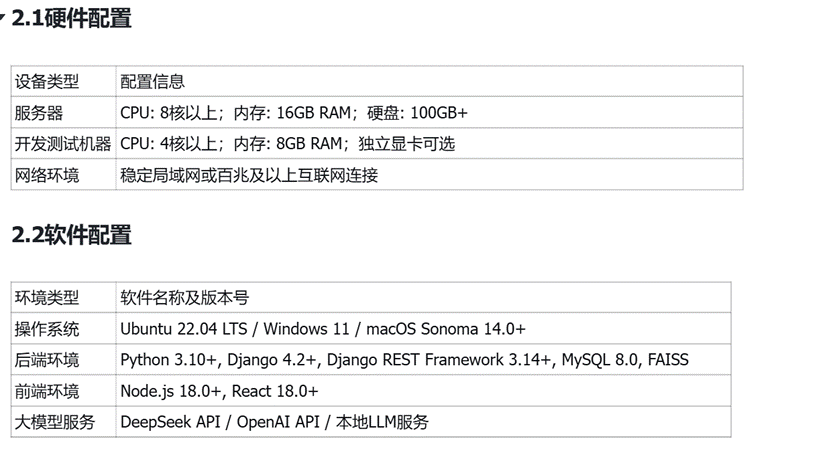<![endif]>

<o:p>&nbsp;</o:p>

第二部分&nbsp; 使用教程

<a name="heading_5"><b
style='mso-bidi-font-weight:normal'>一、注册账号</b></a>

第一步：用户需要输入邮箱、昵称和密码，其中邮箱必须具有标准邮箱格式且一个邮箱不能重复注册账号；昵称不能和其他人重复，密码必须多余8位数字。

<!--[if gte vml 1]><v:shape id="Drawing_x0020_1"
 o:spid="_x0000_i1038" type="#_x0000_t75" style='width:414pt;height:208.5pt;
 visibility:visible;mso-wrap-style:square'>
 <v:imagedata src="08《个人知识库助手网页端》用户使用手册.files/image003.png" o:title=""/>
</v:shape><![endif]--><![if !vml]><![endif]>

<o:p>&nbsp;</o:p>

第二步：用鼠标点击”我已阅读并同意协议“，再点击注册完成注册工作。

<a name="heading_6"><b
style='mso-bidi-font-weight:normal'>二、登录账号</b></a>

第一步、输入昵称和密码，密码可以选择可见或不可见。

第二步、点击”我已阅读并同意协议“

第三步、点击登录

<!--[if gte vml 1]><v:shape id="Drawing_x0020_2"
 o:spid="_x0000_i1037" type="#_x0000_t75" style='width:414pt;height:204.5pt;
 visibility:visible;mso-wrap-style:square'>
 <v:imagedata src="08《个人知识库助手网页端》用户使用手册.files/image005.png" o:title=""/>
</v:shape><![endif]--><![if !vml]><![endif]>

<a name="heading_7"><b
style='mso-bidi-font-weight:normal'>三、新建知识库</b></a>

1、默认知识库;

每个账户自带一个默认知识库，不需要额外创建

<!--[if gte vml 1]><v:shape id="Drawing_x0020_3"
 o:spid="_x0000_i1036" type="#_x0000_t75" style='width:414pt;height:240pt;
 visibility:visible;mso-wrap-style:square'>
 <v:imagedata src="08《个人知识库助手网页端》用户使用手册.files/image007.png" o:title=""/>
</v:shape><![endif]--><![if !vml]>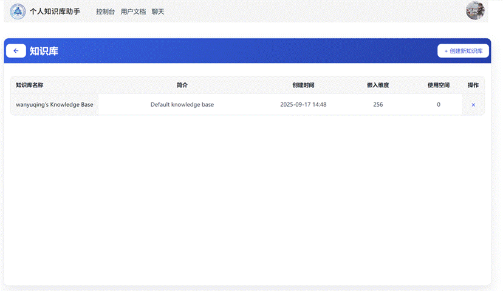<![endif]>

2、点击右上角创建新知识库，可以设置知识库名称，和向量化模型维度，以及知识库描述。

向量化模型维度：向量化模型维度是用来进行知识库相关内容检索的重要指标，向量数据维度越高可以越清晰准确的表示文段内容检索的会越准确，但同时过高的向量数据维度会导致导入文档和检索文档的速度大幅度下降，影响使用体验，用户可以根据自己的需求选择向量化模型维度，一共有128、256、512、1024四个选项，推荐用户在日常使用的时候选择256维度。

<!--[if gte vml 1]><v:shape id="Drawing_x0020_4"
 o:spid="_x0000_i1035" type="#_x0000_t75" style='width:413.5pt;height:234.5pt;
 visibility:visible;mso-wrap-style:square'>
 <v:imagedata src="08《个人知识库助手网页端》用户使用手册.files/image009.png" o:title=""/>
</v:shape><![endif]--><![if !vml]>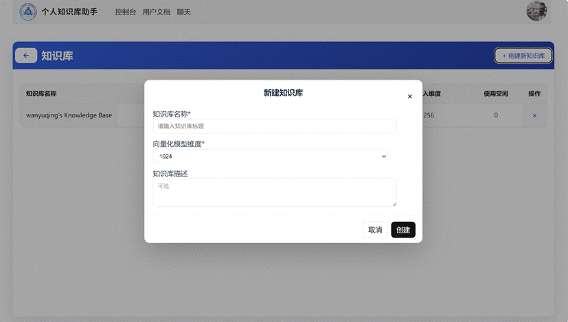<![endif]>

<o:p>&nbsp;</o:p>

<a name="heading_8"><b
style='mso-bidi-font-weight:normal'>四、导入文档</b></a>

第一步、点击知识库名跳转到知识库内部

<!--[if gte vml 1]><v:shape id="Drawing_x0020_5"
 o:spid="_x0000_i1034" type="#_x0000_t75" style='width:414pt;height:237pt;
 visibility:visible;mso-wrap-style:square'>
 <v:imagedata src="08《个人知识库助手网页端》用户使用手册.files/image011.png" o:title=""/>
</v:shape><![endif]--><![if !vml]>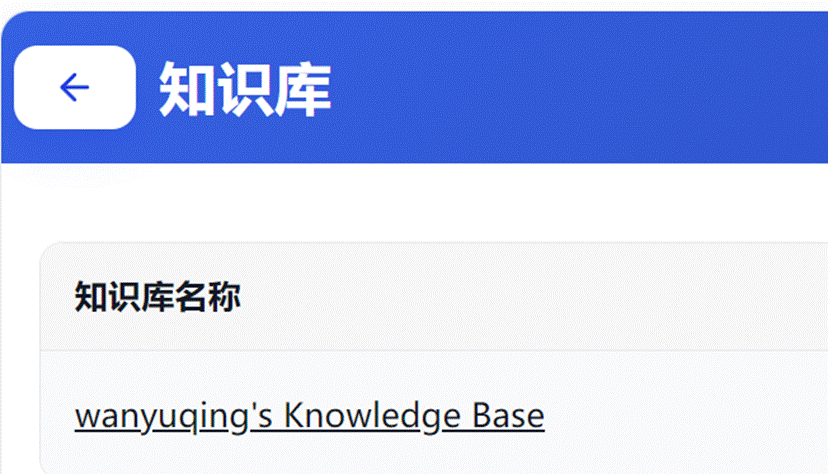<![endif]>

第二步、进入知识库后点击右上角的添加新知识、选择负责导入的大模型。目前有deepseek、智普ai、通意千问三个大模型可以选择。

<!--[if gte vml 1]><v:shape id="Drawing_x0020_6"
 o:spid="_x0000_i1033" type="#_x0000_t75" style='width:414pt;height:233.5pt;
 visibility:visible;mso-wrap-style:square'>
 <v:imagedata src="08《个人知识库助手网页端》用户使用手册.files/image013.png" o:title=""/>
</v:shape><![endif]--><![if !vml]>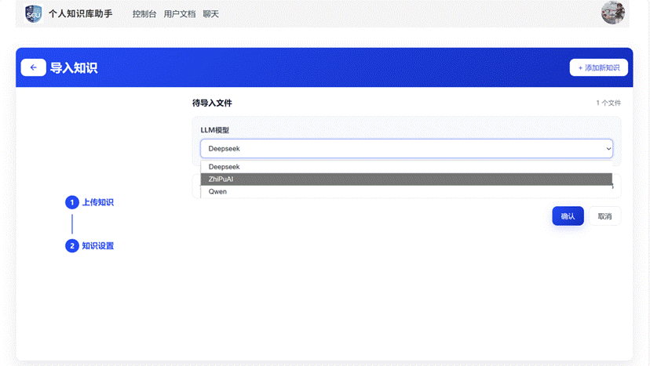<![endif]>

<o:p>&nbsp;</o:p>

<!--[if gte vml 1]><v:shape id="Drawing_x0020_7"
 o:spid="_x0000_i1032" type="#_x0000_t75" style='width:414pt;height:236.5pt;
 visibility:visible;mso-wrap-style:square'>
 <v:imagedata src="08《个人知识库助手网页端》用户使用手册.files/image015.png" o:title=""/>
</v:shape><![endif]--><![if !vml]><![endif]>

<o:p>&nbsp;</o:p>

第三步、点击”点击上传“选择需要上传的文档。文档支持pdf、docx、pptx、ppt、txt、md、xlsx、xls、csv格式。每个文件不能超过100M。文档上传最推荐markdown形式，可以保证检索的准确性。

<!--[if gte vml 1]><v:shape id="Drawing_x0020_8"
 o:spid="_x0000_i1031" type="#_x0000_t75" style='width:414pt;height:238pt;
 visibility:visible;mso-wrap-style:square'>
 <v:imagedata src="08《个人知识库助手网页端》用户使用手册.files/image017.png" o:title=""/>
</v:shape><![endif]--><![if !vml]><![endif]>

第四步、点击打开即可上传文件（上传文件需要一段时间，请安心等待）

<!--[if gte vml 1]><v:shape id="Drawing_x0020_9"
 o:spid="_x0000_i1030" type="#_x0000_t75" style='width:414pt;height:232.5pt;
 visibility:visible;mso-wrap-style:square'>
 <v:imagedata src="08《个人知识库助手网页端》用户使用手册.files/image019.png" o:title=""/>
</v:shape><![endif]--><![if !vml]>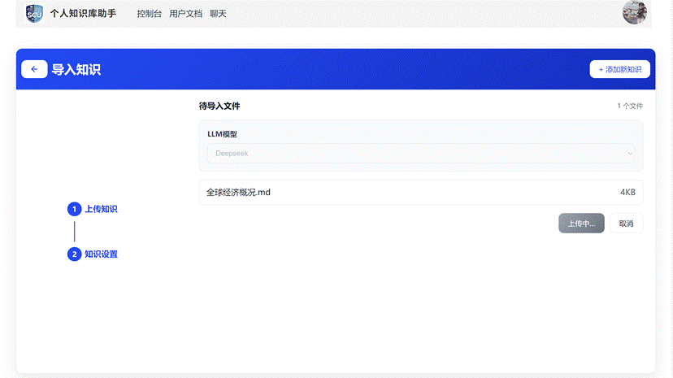<![endif]>

第五步、导入成功，可以在知识库内看到导入的文档了。

<!--[if gte vml 1]><v:shape id="Drawing_x0020_10"
 o:spid="_x0000_i1029" type="#_x0000_t75" style='width:413.5pt;height:229.5pt;
 visibility:visible;mso-wrap-style:square'>
 <v:imagedata src="08《个人知识库助手网页端》用户使用手册.files/image021.png" o:title=""/>
</v:shape><![endif]--><![if !vml]>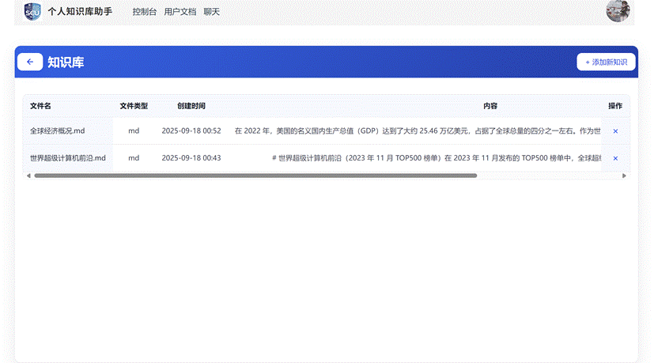<![endif]>

<a name="heading_9"><b
style='mso-bidi-font-weight:normal'>五、新建对话</b></a>

第一步、点击上方”聊天“，进入聊天界面

第二步、选择聊天需要基于的知识库 

<!--[if gte vml 1]><v:shape id="Drawing_x0020_11"
 o:spid="_x0000_i1028" type="#_x0000_t75" style='width:414pt;height:232pt;
 visibility:visible;mso-wrap-style:square'>
 <v:imagedata src="08《个人知识库助手网页端》用户使用手册.files/image023.png" o:title=""/>
</v:shape><![endif]--><![if !vml]>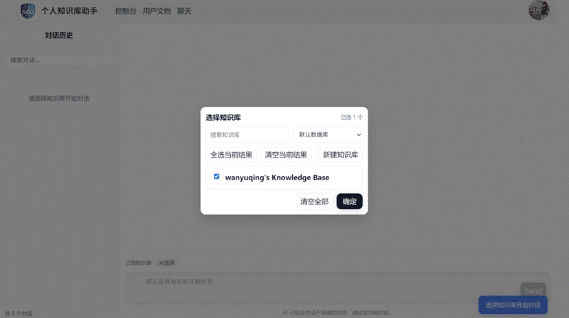<![endif]>

第三步、进入聊天界面，在下方输入问题点击send

<!--[if gte vml 1]><v:shape id="Drawing_x0020_12"
 o:spid="_x0000_i1027" type="#_x0000_t75" style='width:414pt;height:243.5pt;
 visibility:visible;mso-wrap-style:square'>
 <v:imagedata src="08《个人知识库助手网页端》用户使用手册.files/image025.png" o:title=""/>
</v:shape><![endif]--><![if !vml]>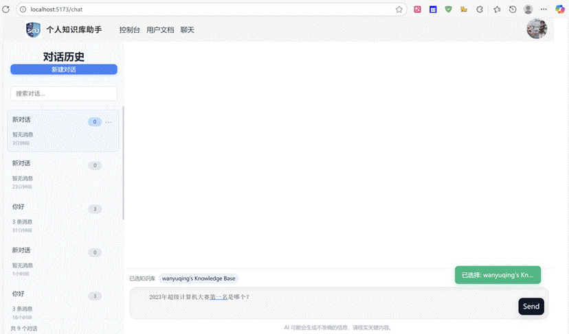<![endif]>

第四步、稍等片刻就可以看到大模型的回答了

<!--[if gte vml 1]><v:shape id="Drawing_x0020_13"
 o:spid="_x0000_i1026" type="#_x0000_t75" style='width:414pt;height:254pt;
 visibility:visible;mso-wrap-style:square'>
 <v:imagedata src="08《个人知识库助手网页端》用户使用手册.files/image027.png" o:title=""/>
</v:shape><![endif]--><![if !vml]>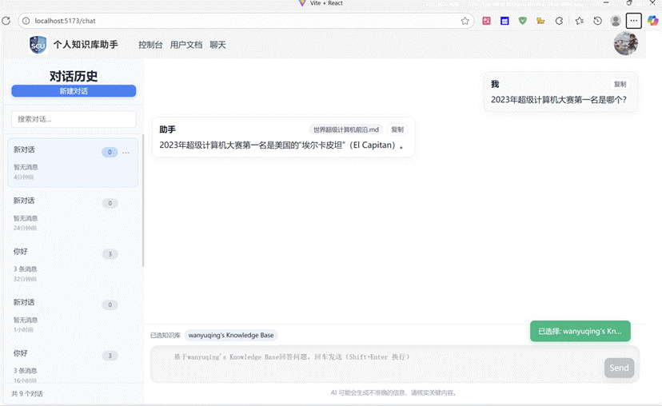<![endif]>

第五步、点击大模型回答可以查看详情，引用的知识库里面什么文章的知识，以及具体文段。

<!--[if gte vml 1]><v:shape id="Drawing_x0020_14"
 o:spid="_x0000_i1025" type="#_x0000_t75" style='width:414pt;height:234pt;
 visibility:visible;mso-wrap-style:square'>
 <v:imagedata src="08《个人知识库助手网页端》用户使用手册.files/image029.png" o:title=""/>
</v:shape><![endif]--><![if !vml]>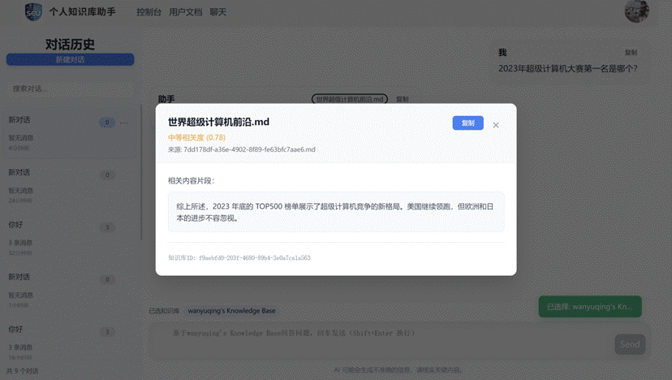<![endif]>

<o:p>&nbsp;</o:p>

<o:p>&nbsp;</o:p>

<o:p>&nbsp;</o:p>

</body>

</html>
