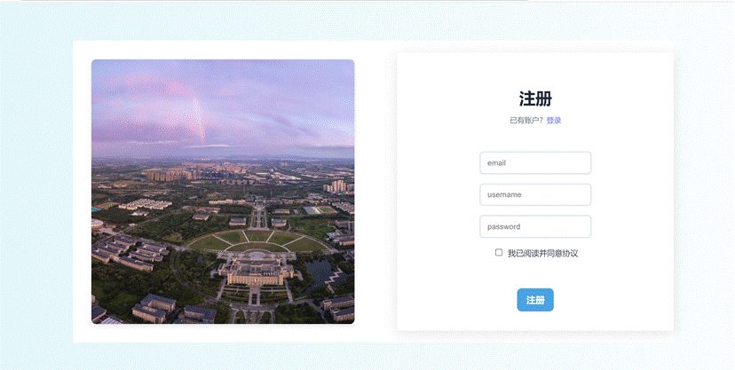
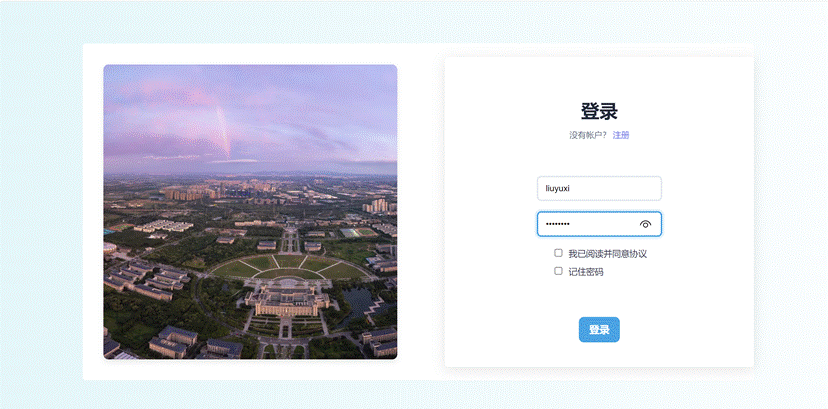

<html xmlns:v="urn:schemas-microsoft-com:vml"
xmlns:o="urn:schemas-microsoft-com:office:office"
xmlns:w="urn:schemas-microsoft-com:office:word"
xmlns:m="http://schemas.microsoft.com/office/2004/12/omml"
xmlns="http://www.w3.org/TR/REC-html40">

<head>
<meta http-equiv=Content-Type content="text/html; charset=gb2312">
<meta name=ProgId content=Word.Document>
<meta name=Generator content="Microsoft Word 15">
<meta name=Originator content="Microsoft Word 15">
<link rel=File-List href="08《个人知识库助手网页端》用户使用手册.files/filelist.xml">
<link rel=Edit-Time-Data href="08《个人知识库助手网页端》用户使用手册.files/editdata.mso">
<!--[if !mso]>

<![endif]--><!--[if gte mso 9]><xml>
 <o:DocumentProperties>
  <o:Author>Apache POI</o:Author>
  <o:LastAuthor>Zihan Wang</o:LastAuthor>
  <o:Revision>2</o:Revision>
  <o:TotalTime>1</o:TotalTime>
  <o:Created>2025-09-18T03:31:00Z</o:Created>
  <o:LastSaved>2025-09-18T03:31:00Z</o:LastSaved>
  <o:Pages>10</o:Pages>
  <o:Words>926</o:Words>
  <o:Characters>992</o:Characters>
  <o:Lines>70</o:Lines>
  <o:Paragraphs>58</o:Paragraphs>
  <o:CharactersWithSpaces>1860</o:CharactersWithSpaces>
  <o:Version>16.00</o:Version>
 </o:DocumentProperties>
</xml><![endif]-->
<link rel=themeData href="08《个人知识库助手网页端》用户使用手册.files/themedata.thmx">
<link rel=colorSchemeMapping
href="08《个人知识库助手网页端》用户使用手册.files/colorschememapping.xml">
<!--[if gte mso 9]><xml>
 <w:WordDocument>
  <w:SpellingState>Clean</w:SpellingState>
  <w:GrammarState>Clean</w:GrammarState>
  <w:TrackMoves>false</w:TrackMoves>
  <w:TrackFormatting/>
  <w:PunctuationKerning/>
  <w:ValidateAgainstSchemas/>
  <w:SaveIfXMLInvalid>false</w:SaveIfXMLInvalid>
  <w:IgnoreMixedContent>false</w:IgnoreMixedContent>
  <w:AlwaysShowPlaceholderText>false</w:AlwaysShowPlaceholderText>
  <w:DoNotPromoteQF/>
  <w:LidThemeOther>EN-US</w:LidThemeOther>
  <w:LidThemeAsian>ZH-CN</w:LidThemeAsian>
  <w:LidThemeComplexScript>X-NONE</w:LidThemeComplexScript>
  <w:Compatibility>
   <w:BreakWrappedTables/>
   <w:SnapToGridInCell/>
   <w:WrapTextWithPunct/>
   <w:UseAsianBreakRules/>
   <w:UseWord2010TableStyleRules/>
   <w:DontGrowAutofit/>
   <w:SplitPgBreakAndParaMark/>
   <w:UseFELayout/>
  </w:Compatibility>
  <w:DoNotOptimizeForBrowser/>
  <m:mathPr>
   <m:mathFont m:val="Cambria Math"/>
   <m:brkBin m:val="before"/>
   <m:brkBinSub m:val="&#45;-"/>
   <m:smallFrac m:val="off"/>
   <m:dispDef/>
   <m:lMargin m:val="0"/>
   <m:rMargin m:val="0"/>
   <m:defJc m:val="centerGroup"/>
   <m:wrapIndent m:val="1440"/>
   <m:intLim m:val="subSup"/>
   <m:naryLim m:val="undOvr"/>
  </m:mathPr></w:WordDocument>
</xml><![endif]--><!--[if gte mso 9]><xml>
 <w:LatentStyles DefLockedState="false" DefUnhideWhenUsed="false"
  DefSemiHidden="false" DefQFormat="false" DefPriority="99"
  LatentStyleCount="376">
  <w:LsdException Locked="false" Priority="0" QFormat="true" Name="Normal"/>
  <w:LsdException Locked="false" Priority="9" QFormat="true" Name="heading 1"/>
  <w:LsdException Locked="false" Priority="9" SemiHidden="true"
   UnhideWhenUsed="true" QFormat="true" Name="heading 2"/>
  <w:LsdException Locked="false" Priority="9" SemiHidden="true"
   UnhideWhenUsed="true" QFormat="true" Name="heading 3"/>
  <w:LsdException Locked="false" Priority="9" SemiHidden="true"
   UnhideWhenUsed="true" QFormat="true" Name="heading 4"/>
  <w:LsdException Locked="false" Priority="9" SemiHidden="true"
   UnhideWhenUsed="true" QFormat="true" Name="heading 5"/>
  <w:LsdException Locked="false" Priority="9" SemiHidden="true"
   UnhideWhenUsed="true" QFormat="true" Name="heading 6"/>
  <w:LsdException Locked="false" Priority="9" SemiHidden="true"
   UnhideWhenUsed="true" QFormat="true" Name="heading 7"/>
  <w:LsdException Locked="false" Priority="9" SemiHidden="true"
   UnhideWhenUsed="true" QFormat="true" Name="heading 8"/>
  <w:LsdException Locked="false" Priority="9" SemiHidden="true"
   UnhideWhenUsed="true" QFormat="true" Name="heading 9"/>
  <w:LsdException Locked="false" SemiHidden="true" UnhideWhenUsed="true"
   Name="index 1"/>
  <w:LsdException Locked="false" SemiHidden="true" UnhideWhenUsed="true"
   Name="index 2"/>
  <w:LsdException Locked="false" SemiHidden="true" UnhideWhenUsed="true"
   Name="index 3"/>
  <w:LsdException Locked="false" SemiHidden="true" UnhideWhenUsed="true"
   Name="index 4"/>
  <w:LsdException Locked="false" SemiHidden="true" UnhideWhenUsed="true"
   Name="index 5"/>
  <w:LsdException Locked="false" SemiHidden="true" UnhideWhenUsed="true"
   Name="index 6"/>
  <w:LsdException Locked="false" SemiHidden="true" UnhideWhenUsed="true"
   Name="index 7"/>
  <w:LsdException Locked="false" SemiHidden="true" UnhideWhenUsed="true"
   Name="index 8"/>
  <w:LsdException Locked="false" SemiHidden="true" UnhideWhenUsed="true"
   Name="index 9"/>
  <w:LsdException Locked="false" Priority="39" SemiHidden="true"
   UnhideWhenUsed="true" Name="toc 1"/>
  <w:LsdException Locked="false" Priority="39" SemiHidden="true"
   UnhideWhenUsed="true" Name="toc 2"/>
  <w:LsdException Locked="false" Priority="39" SemiHidden="true"
   UnhideWhenUsed="true" Name="toc 3"/>
  <w:LsdException Locked="false" Priority="39" SemiHidden="true"
   UnhideWhenUsed="true" Name="toc 4"/>
  <w:LsdException Locked="false" Priority="39" SemiHidden="true"
   UnhideWhenUsed="true" Name="toc 5"/>
  <w:LsdException Locked="false" Priority="39" SemiHidden="true"
   UnhideWhenUsed="true" Name="toc 6"/>
  <w:LsdException Locked="false" Priority="39" SemiHidden="true"
   UnhideWhenUsed="true" Name="toc 7"/>
  <w:LsdException Locked="false" Priority="39" SemiHidden="true"
   UnhideWhenUsed="true" Name="toc 8"/>
  <w:LsdException Locked="false" Priority="39" SemiHidden="true"
   UnhideWhenUsed="true" Name="toc 9"/>
  <w:LsdException Locked="false" SemiHidden="true" UnhideWhenUsed="true"
   Name="Normal Indent"/>
  <w:LsdException Locked="false" SemiHidden="true" UnhideWhenUsed="true"
   Name="footnote text"/>
  <w:LsdException Locked="false" SemiHidden="true" UnhideWhenUsed="true"
   Name="annotation text"/>
  <w:LsdException Locked="false" SemiHidden="true" UnhideWhenUsed="true"
   Name="header"/>
  <w:LsdException Locked="false" SemiHidden="true" UnhideWhenUsed="true"
   Name="footer"/>
  <w:LsdException Locked="false" SemiHidden="true" UnhideWhenUsed="true"
   Name="index heading"/>
  <w:LsdException Locked="false" Priority="35" SemiHidden="true"
   UnhideWhenUsed="true" QFormat="true" Name="caption"/>
  <w:LsdException Locked="false" SemiHidden="true" UnhideWhenUsed="true"
   Name="table of figures"/>
  <w:LsdException Locked="false" SemiHidden="true" UnhideWhenUsed="true"
   Name="envelope address"/>
  <w:LsdException Locked="false" SemiHidden="true" UnhideWhenUsed="true"
   Name="envelope return"/>
  <w:LsdException Locked="false" SemiHidden="true" UnhideWhenUsed="true"
   Name="footnote reference"/>
  <w:LsdException Locked="false" SemiHidden="true" UnhideWhenUsed="true"
   Name="annotation reference"/>
  <w:LsdException Locked="false" SemiHidden="true" UnhideWhenUsed="true"
   Name="line number"/>
  <w:LsdException Locked="false" SemiHidden="true" UnhideWhenUsed="true"
   Name="page number"/>
  <w:LsdException Locked="false" SemiHidden="true" UnhideWhenUsed="true"
   Name="endnote reference"/>
  <w:LsdException Locked="false" SemiHidden="true" UnhideWhenUsed="true"
   Name="endnote text"/>
  <w:LsdException Locked="false" SemiHidden="true" UnhideWhenUsed="true"
   Name="table of authorities"/>
  <w:LsdException Locked="false" SemiHidden="true" UnhideWhenUsed="true"
   Name="macro"/>
  <w:LsdException Locked="false" SemiHidden="true" UnhideWhenUsed="true"
   Name="toa heading"/>
  <w:LsdException Locked="false" SemiHidden="true" UnhideWhenUsed="true"
   Name="List"/>
  <w:LsdException Locked="false" SemiHidden="true" UnhideWhenUsed="true"
   Name="List Bullet"/>
  <w:LsdException Locked="false" SemiHidden="true" UnhideWhenUsed="true"
   Name="List Number"/>
  <w:LsdException Locked="false" SemiHidden="true" UnhideWhenUsed="true"
   Name="List 2"/>
  <w:LsdException Locked="false" SemiHidden="true" UnhideWhenUsed="true"
   Name="List 3"/>
  <w:LsdException Locked="false" SemiHidden="true" UnhideWhenUsed="true"
   Name="List 4"/>
  <w:LsdException Locked="false" SemiHidden="true" UnhideWhenUsed="true"
   Name="List 5"/>
  <w:LsdException Locked="false" SemiHidden="true" UnhideWhenUsed="true"
   Name="List Bullet 2"/>
  <w:LsdException Locked="false" SemiHidden="true" UnhideWhenUsed="true"
   Name="List Bullet 3"/>
  <w:LsdException Locked="false" SemiHidden="true" UnhideWhenUsed="true"
   Name="List Bullet 4"/>
  <w:LsdException Locked="false" SemiHidden="true" UnhideWhenUsed="true"
   Name="List Bullet 5"/>
  <w:LsdException Locked="false" SemiHidden="true" UnhideWhenUsed="true"
   Name="List Number 2"/>
  <w:LsdException Locked="false" SemiHidden="true" UnhideWhenUsed="true"
   Name="List Number 3"/>
  <w:LsdException Locked="false" SemiHidden="true" UnhideWhenUsed="true"
   Name="List Number 4"/>
  <w:LsdException Locked="false" SemiHidden="true" UnhideWhenUsed="true"
   Name="List Number 5"/>
  <w:LsdException Locked="false" Priority="10" QFormat="true" Name="Title"/>
  <w:LsdException Locked="false" SemiHidden="true" UnhideWhenUsed="true"
   Name="Closing"/>
  <w:LsdException Locked="false" SemiHidden="true" UnhideWhenUsed="true"
   Name="Signature"/>
  <w:LsdException Locked="false" Priority="1" SemiHidden="true"
   UnhideWhenUsed="true" Name="Default Paragraph Font"/>
  <w:LsdException Locked="false" SemiHidden="true" UnhideWhenUsed="true"
   Name="Body Text"/>
  <w:LsdException Locked="false" SemiHidden="true" UnhideWhenUsed="true"
   Name="Body Text Indent"/>
  <w:LsdException Locked="false" SemiHidden="true" UnhideWhenUsed="true"
   Name="List Continue"/>
  <w:LsdException Locked="false" SemiHidden="true" UnhideWhenUsed="true"
   Name="List Continue 2"/>
  <w:LsdException Locked="false" SemiHidden="true" UnhideWhenUsed="true"
   Name="List Continue 3"/>
  <w:LsdException Locked="false" SemiHidden="true" UnhideWhenUsed="true"
   Name="List Continue 4"/>
  <w:LsdException Locked="false" SemiHidden="true" UnhideWhenUsed="true"
   Name="List Continue 5"/>
  <w:LsdException Locked="false" SemiHidden="true" UnhideWhenUsed="true"
   Name="Message Header"/>
  <w:LsdException Locked="false" Priority="11" QFormat="true" Name="Subtitle"/>
  <w:LsdException Locked="false" SemiHidden="true" UnhideWhenUsed="true"
   Name="Salutation"/>
  <w:LsdException Locked="false" SemiHidden="true" UnhideWhenUsed="true"
   Name="Date"/>
  <w:LsdException Locked="false" SemiHidden="true" UnhideWhenUsed="true"
   Name="Body Text First Indent"/>
  <w:LsdException Locked="false" SemiHidden="true" UnhideWhenUsed="true"
   Name="Body Text First Indent 2"/>
  <w:LsdException Locked="false" SemiHidden="true" UnhideWhenUsed="true"
   Name="Note Heading"/>
  <w:LsdException Locked="false" SemiHidden="true" UnhideWhenUsed="true"
   Name="Body Text 2"/>
  <w:LsdException Locked="false" SemiHidden="true" UnhideWhenUsed="true"
   Name="Body Text 3"/>
  <w:LsdException Locked="false" SemiHidden="true" UnhideWhenUsed="true"
   Name="Body Text Indent 2"/>
  <w:LsdException Locked="false" SemiHidden="true" UnhideWhenUsed="true"
   Name="Body Text Indent 3"/>
  <w:LsdException Locked="false" SemiHidden="true" UnhideWhenUsed="true"
   Name="Block Text"/>
  <w:LsdException Locked="false" SemiHidden="true" UnhideWhenUsed="true"
   Name="Hyperlink"/>
  <w:LsdException Locked="false" SemiHidden="true" UnhideWhenUsed="true"
   Name="FollowedHyperlink"/>
  <w:LsdException Locked="false" Priority="22" QFormat="true" Name="Strong"/>
  <w:LsdException Locked="false" Priority="20" QFormat="true" Name="Emphasis"/>
  <w:LsdException Locked="false" SemiHidden="true" UnhideWhenUsed="true"
   Name="Document Map"/>
  <w:LsdException Locked="false" SemiHidden="true" UnhideWhenUsed="true"
   Name="Plain Text"/>
  <w:LsdException Locked="false" SemiHidden="true" UnhideWhenUsed="true"
   Name="E-mail Signature"/>
  <w:LsdException Locked="false" SemiHidden="true" UnhideWhenUsed="true"
   Name="HTML Top of Form"/>
  <w:LsdException Locked="false" SemiHidden="true" UnhideWhenUsed="true"
   Name="HTML Bottom of Form"/>
  <w:LsdException Locked="false" SemiHidden="true" UnhideWhenUsed="true"
   Name="Normal (Web)"/>
  <w:LsdException Locked="false" SemiHidden="true" UnhideWhenUsed="true"
   Name="HTML Acronym"/>
  <w:LsdException Locked="false" SemiHidden="true" UnhideWhenUsed="true"
   Name="HTML Address"/>
  <w:LsdException Locked="false" SemiHidden="true" UnhideWhenUsed="true"
   Name="HTML Cite"/>
  <w:LsdException Locked="false" SemiHidden="true" UnhideWhenUsed="true"
   Name="HTML Code"/>
  <w:LsdException Locked="false" SemiHidden="true" UnhideWhenUsed="true"
   Name="HTML Definition"/>
  <w:LsdException Locked="false" SemiHidden="true" UnhideWhenUsed="true"
   Name="HTML Keyboard"/>
  <w:LsdException Locked="false" SemiHidden="true" UnhideWhenUsed="true"
   Name="HTML Preformatted"/>
  <w:LsdException Locked="false" SemiHidden="true" UnhideWhenUsed="true"
   Name="HTML Sample"/>
  <w:LsdException Locked="false" SemiHidden="true" UnhideWhenUsed="true"
   Name="HTML Typewriter"/>
  <w:LsdException Locked="false" SemiHidden="true" UnhideWhenUsed="true"
   Name="HTML Variable"/>
  <w:LsdException Locked="false" SemiHidden="true" UnhideWhenUsed="true"
   Name="Normal Table"/>
  <w:LsdException Locked="false" SemiHidden="true" UnhideWhenUsed="true"
   Name="annotation subject"/>
  <w:LsdException Locked="false" SemiHidden="true" UnhideWhenUsed="true"
   Name="No List"/>
  <w:LsdException Locked="false" SemiHidden="true" UnhideWhenUsed="true"
   Name="Outline List 1"/>
  <w:LsdException Locked="false" SemiHidden="true" UnhideWhenUsed="true"
   Name="Outline List 2"/>
  <w:LsdException Locked="false" SemiHidden="true" UnhideWhenUsed="true"
   Name="Outline List 3"/>
  <w:LsdException Locked="false" SemiHidden="true" UnhideWhenUsed="true"
   Name="Table Simple 1"/>
  <w:LsdException Locked="false" SemiHidden="true" UnhideWhenUsed="true"
   Name="Table Simple 2"/>
  <w:LsdException Locked="false" SemiHidden="true" UnhideWhenUsed="true"
   Name="Table Simple 3"/>
  <w:LsdException Locked="false" SemiHidden="true" UnhideWhenUsed="true"
   Name="Table Classic 1"/>
  <w:LsdException Locked="false" SemiHidden="true" UnhideWhenUsed="true"
   Name="Table Classic 2"/>
  <w:LsdException Locked="false" SemiHidden="true" UnhideWhenUsed="true"
   Name="Table Classic 3"/>
  <w:LsdException Locked="false" SemiHidden="true" UnhideWhenUsed="true"
   Name="Table Classic 4"/>
  <w:LsdException Locked="false" SemiHidden="true" UnhideWhenUsed="true"
   Name="Table Colorful 1"/>
  <w:LsdException Locked="false" SemiHidden="true" UnhideWhenUsed="true"
   Name="Table Colorful 2"/>
  <w:LsdException Locked="false" SemiHidden="true" UnhideWhenUsed="true"
   Name="Table Colorful 3"/>
  <w:LsdException Locked="false" SemiHidden="true" UnhideWhenUsed="true"
   Name="Table Columns 1"/>
  <w:LsdException Locked="false" SemiHidden="true" UnhideWhenUsed="true"
   Name="Table Columns 2"/>
  <w:LsdException Locked="false" SemiHidden="true" UnhideWhenUsed="true"
   Name="Table Columns 3"/>
  <w:LsdException Locked="false" SemiHidden="true" UnhideWhenUsed="true"
   Name="Table Columns 4"/>
  <w:LsdException Locked="false" SemiHidden="true" UnhideWhenUsed="true"
   Name="Table Columns 5"/>
  <w:LsdException Locked="false" SemiHidden="true" UnhideWhenUsed="true"
   Name="Table Grid 1"/>
  <w:LsdException Locked="false" SemiHidden="true" UnhideWhenUsed="true"
   Name="Table Grid 2"/>
  <w:LsdException Locked="false" SemiHidden="true" UnhideWhenUsed="true"
   Name="Table Grid 3"/>
  <w:LsdException Locked="false" SemiHidden="true" UnhideWhenUsed="true"
   Name="Table Grid 4"/>
  <w:LsdException Locked="false" SemiHidden="true" UnhideWhenUsed="true"
   Name="Table Grid 5"/>
  <w:LsdException Locked="false" SemiHidden="true" UnhideWhenUsed="true"
   Name="Table Grid 6"/>
  <w:LsdException Locked="false" SemiHidden="true" UnhideWhenUsed="true"
   Name="Table Grid 7"/>
  <w:LsdException Locked="false" SemiHidden="true" UnhideWhenUsed="true"
   Name="Table Grid 8"/>
  <w:LsdException Locked="false" SemiHidden="true" UnhideWhenUsed="true"
   Name="Table List 1"/>
  <w:LsdException Locked="false" SemiHidden="true" UnhideWhenUsed="true"
   Name="Table List 2"/>
  <w:LsdException Locked="false" SemiHidden="true" UnhideWhenUsed="true"
   Name="Table List 3"/>
  <w:LsdException Locked="false" SemiHidden="true" UnhideWhenUsed="true"
   Name="Table List 4"/>
  <w:LsdException Locked="false" SemiHidden="true" UnhideWhenUsed="true"
   Name="Table List 5"/>
  <w:LsdException Locked="false" SemiHidden="true" UnhideWhenUsed="true"
   Name="Table List 6"/>
  <w:LsdException Locked="false" SemiHidden="true" UnhideWhenUsed="true"
   Name="Table List 7"/>
  <w:LsdException Locked="false" SemiHidden="true" UnhideWhenUsed="true"
   Name="Table List 8"/>
  <w:LsdException Locked="false" SemiHidden="true" UnhideWhenUsed="true"
   Name="Table 3D effects 1"/>
  <w:LsdException Locked="false" SemiHidden="true" UnhideWhenUsed="true"
   Name="Table 3D effects 2"/>
  <w:LsdException Locked="false" SemiHidden="true" UnhideWhenUsed="true"
   Name="Table 3D effects 3"/>
  <w:LsdException Locked="false" SemiHidden="true" UnhideWhenUsed="true"
   Name="Table Contemporary"/>
  <w:LsdException Locked="false" SemiHidden="true" UnhideWhenUsed="true"
   Name="Table Elegant"/>
  <w:LsdException Locked="false" SemiHidden="true" UnhideWhenUsed="true"
   Name="Table Professional"/>
  <w:LsdException Locked="false" SemiHidden="true" UnhideWhenUsed="true"
   Name="Table Subtle 1"/>
  <w:LsdException Locked="false" SemiHidden="true" UnhideWhenUsed="true"
   Name="Table Subtle 2"/>
  <w:LsdException Locked="false" SemiHidden="true" UnhideWhenUsed="true"
   Name="Table Web 1"/>
  <w:LsdException Locked="false" SemiHidden="true" UnhideWhenUsed="true"
   Name="Table Web 2"/>
  <w:LsdException Locked="false" SemiHidden="true" UnhideWhenUsed="true"
   Name="Table Web 3"/>
  <w:LsdException Locked="false" SemiHidden="true" UnhideWhenUsed="true"
   Name="Balloon Text"/>
  <w:LsdException Locked="false" Priority="39" Name="Table Grid"/>
  <w:LsdException Locked="false" SemiHidden="true" UnhideWhenUsed="true"
   Name="Table Theme"/>
  <w:LsdException Locked="false" SemiHidden="true" Name="Placeholder Text"/>
  <w:LsdException Locked="false" Priority="1" QFormat="true" Name="No Spacing"/>
  <w:LsdException Locked="false" Priority="60" Name="Light Shading"/>
  <w:LsdException Locked="false" Priority="61" Name="Light List"/>
  <w:LsdException Locked="false" Priority="62" Name="Light Grid"/>
  <w:LsdException Locked="false" Priority="63" Name="Medium Shading 1"/>
  <w:LsdException Locked="false" Priority="64" Name="Medium Shading 2"/>
  <w:LsdException Locked="false" Priority="65" Name="Medium List 1"/>
  <w:LsdException Locked="false" Priority="66" Name="Medium List 2"/>
  <w:LsdException Locked="false" Priority="67" Name="Medium Grid 1"/>
  <w:LsdException Locked="false" Priority="68" Name="Medium Grid 2"/>
  <w:LsdException Locked="false" Priority="69" Name="Medium Grid 3"/>
  <w:LsdException Locked="false" Priority="70" Name="Dark List"/>
  <w:LsdException Locked="false" Priority="71" Name="Colorful Shading"/>
  <w:LsdException Locked="false" Priority="72" Name="Colorful List"/>
  <w:LsdException Locked="false" Priority="73" Name="Colorful Grid"/>
  <w:LsdException Locked="false" Priority="60" Name="Light Shading Accent 1"/>
  <w:LsdException Locked="false" Priority="61" Name="Light List Accent 1"/>
  <w:LsdException Locked="false" Priority="62" Name="Light Grid Accent 1"/>
  <w:LsdException Locked="false" Priority="63" Name="Medium Shading 1 Accent 1"/>
  <w:LsdException Locked="false" Priority="64" Name="Medium Shading 2 Accent 1"/>
  <w:LsdException Locked="false" Priority="65" Name="Medium List 1 Accent 1"/>
  <w:LsdException Locked="false" SemiHidden="true" Name="Revision"/>
  <w:LsdException Locked="false" Priority="34" QFormat="true"
   Name="List Paragraph"/>
  <w:LsdException Locked="false" Priority="29" QFormat="true" Name="Quote"/>
  <w:LsdException Locked="false" Priority="30" QFormat="true"
   Name="Intense Quote"/>
  <w:LsdException Locked="false" Priority="66" Name="Medium List 2 Accent 1"/>
  <w:LsdException Locked="false" Priority="67" Name="Medium Grid 1 Accent 1"/>
  <w:LsdException Locked="false" Priority="68" Name="Medium Grid 2 Accent 1"/>
  <w:LsdException Locked="false" Priority="69" Name="Medium Grid 3 Accent 1"/>
  <w:LsdException Locked="false" Priority="70" Name="Dark List Accent 1"/>
  <w:LsdException Locked="false" Priority="71" Name="Colorful Shading Accent 1"/>
  <w:LsdException Locked="false" Priority="72" Name="Colorful List Accent 1"/>
  <w:LsdException Locked="false" Priority="73" Name="Colorful Grid Accent 1"/>
  <w:LsdException Locked="false" Priority="60" Name="Light Shading Accent 2"/>
  <w:LsdException Locked="false" Priority="61" Name="Light List Accent 2"/>
  <w:LsdException Locked="false" Priority="62" Name="Light Grid Accent 2"/>
  <w:LsdException Locked="false" Priority="63" Name="Medium Shading 1 Accent 2"/>
  <w:LsdException Locked="false" Priority="64" Name="Medium Shading 2 Accent 2"/>
  <w:LsdException Locked="false" Priority="65" Name="Medium List 1 Accent 2"/>
  <w:LsdException Locked="false" Priority="66" Name="Medium List 2 Accent 2"/>
  <w:LsdException Locked="false" Priority="67" Name="Medium Grid 1 Accent 2"/>
  <w:LsdException Locked="false" Priority="68" Name="Medium Grid 2 Accent 2"/>
  <w:LsdException Locked="false" Priority="69" Name="Medium Grid 3 Accent 2"/>
  <w:LsdException Locked="false" Priority="70" Name="Dark List Accent 2"/>
  <w:LsdException Locked="false" Priority="71" Name="Colorful Shading Accent 2"/>
  <w:LsdException Locked="false" Priority="72" Name="Colorful List Accent 2"/>
  <w:LsdException Locked="false" Priority="73" Name="Colorful Grid Accent 2"/>
  <w:LsdException Locked="false" Priority="60" Name="Light Shading Accent 3"/>
  <w:LsdException Locked="false" Priority="61" Name="Light List Accent 3"/>
  <w:LsdException Locked="false" Priority="62" Name="Light Grid Accent 3"/>
  <w:LsdException Locked="false" Priority="63" Name="Medium Shading 1 Accent 3"/>
  <w:LsdException Locked="false" Priority="64" Name="Medium Shading 2 Accent 3"/>
  <w:LsdException Locked="false" Priority="65" Name="Medium List 1 Accent 3"/>
  <w:LsdException Locked="false" Priority="66" Name="Medium List 2 Accent 3"/>
  <w:LsdException Locked="false" Priority="67" Name="Medium Grid 1 Accent 3"/>
  <w:LsdException Locked="false" Priority="68" Name="Medium Grid 2 Accent 3"/>
  <w:LsdException Locked="false" Priority="69" Name="Medium Grid 3 Accent 3"/>
  <w:LsdException Locked="false" Priority="70" Name="Dark List Accent 3"/>
  <w:LsdException Locked="false" Priority="71" Name="Colorful Shading Accent 3"/>
  <w:LsdException Locked="false" Priority="72" Name="Colorful List Accent 3"/>
  <w:LsdException Locked="false" Priority="73" Name="Colorful Grid Accent 3"/>
  <w:LsdException Locked="false" Priority="60" Name="Light Shading Accent 4"/>
  <w:LsdException Locked="false" Priority="61" Name="Light List Accent 4"/>
  <w:LsdException Locked="false" Priority="62" Name="Light Grid Accent 4"/>
  <w:LsdException Locked="false" Priority="63" Name="Medium Shading 1 Accent 4"/>
  <w:LsdException Locked="false" Priority="64" Name="Medium Shading 2 Accent 4"/>
  <w:LsdException Locked="false" Priority="65" Name="Medium List 1 Accent 4"/>
  <w:LsdException Locked="false" Priority="66" Name="Medium List 2 Accent 4"/>
  <w:LsdException Locked="false" Priority="67" Name="Medium Grid 1 Accent 4"/>
  <w:LsdException Locked="false" Priority="68" Name="Medium Grid 2 Accent 4"/>
  <w:LsdException Locked="false" Priority="69" Name="Medium Grid 3 Accent 4"/>
  <w:LsdException Locked="false" Priority="70" Name="Dark List Accent 4"/>
  <w:LsdException Locked="false" Priority="71" Name="Colorful Shading Accent 4"/>
  <w:LsdException Locked="false" Priority="72" Name="Colorful List Accent 4"/>
  <w:LsdException Locked="false" Priority="73" Name="Colorful Grid Accent 4"/>
  <w:LsdException Locked="false" Priority="60" Name="Light Shading Accent 5"/>
  <w:LsdException Locked="false" Priority="61" Name="Light List Accent 5"/>
  <w:LsdException Locked="false" Priority="62" Name="Light Grid Accent 5"/>
  <w:LsdException Locked="false" Priority="63" Name="Medium Shading 1 Accent 5"/>
  <w:LsdException Locked="false" Priority="64" Name="Medium Shading 2 Accent 5"/>
  <w:LsdException Locked="false" Priority="65" Name="Medium List 1 Accent 5"/>
  <w:LsdException Locked="false" Priority="66" Name="Medium List 2 Accent 5"/>
  <w:LsdException Locked="false" Priority="67" Name="Medium Grid 1 Accent 5"/>
  <w:LsdException Locked="false" Priority="68" Name="Medium Grid 2 Accent 5"/>
  <w:LsdException Locked="false" Priority="69" Name="Medium Grid 3 Accent 5"/>
  <w:LsdException Locked="false" Priority="70" Name="Dark List Accent 5"/>
  <w:LsdException Locked="false" Priority="71" Name="Colorful Shading Accent 5"/>
  <w:LsdException Locked="false" Priority="72" Name="Colorful List Accent 5"/>
  <w:LsdException Locked="false" Priority="73" Name="Colorful Grid Accent 5"/>
  <w:LsdException Locked="false" Priority="60" Name="Light Shading Accent 6"/>
  <w:LsdException Locked="false" Priority="61" Name="Light List Accent 6"/>
  <w:LsdException Locked="false" Priority="62" Name="Light Grid Accent 6"/>
  <w:LsdException Locked="false" Priority="63" Name="Medium Shading 1 Accent 6"/>
  <w:LsdException Locked="false" Priority="64" Name="Medium Shading 2 Accent 6"/>
  <w:LsdException Locked="false" Priority="65" Name="Medium List 1 Accent 6"/>
  <w:LsdException Locked="false" Priority="66" Name="Medium List 2 Accent 6"/>
  <w:LsdException Locked="false" Priority="67" Name="Medium Grid 1 Accent 6"/>
  <w:LsdException Locked="false" Priority="68" Name="Medium Grid 2 Accent 6"/>
  <w:LsdException Locked="false" Priority="69" Name="Medium Grid 3 Accent 6"/>
  <w:LsdException Locked="false" Priority="70" Name="Dark List Accent 6"/>
  <w:LsdException Locked="false" Priority="71" Name="Colorful Shading Accent 6"/>
  <w:LsdException Locked="false" Priority="72" Name="Colorful List Accent 6"/>
  <w:LsdException Locked="false" Priority="73" Name="Colorful Grid Accent 6"/>
  <w:LsdException Locked="false" Priority="19" QFormat="true"
   Name="Subtle Emphasis"/>
  <w:LsdException Locked="false" Priority="21" QFormat="true"
   Name="Intense Emphasis"/>
  <w:LsdException Locked="false" Priority="31" QFormat="true"
   Name="Subtle Reference"/>
  <w:LsdException Locked="false" Priority="32" QFormat="true"
   Name="Intense Reference"/>
  <w:LsdException Locked="false" Priority="33" QFormat="true" Name="Book Title"/>
  <w:LsdException Locked="false" Priority="37" SemiHidden="true"
   UnhideWhenUsed="true" Name="Bibliography"/>
  <w:LsdException Locked="false" Priority="39" SemiHidden="true"
   UnhideWhenUsed="true" QFormat="true" Name="TOC Heading"/>
  <w:LsdException Locked="false" Priority="41" Name="Plain Table 1"/>
  <w:LsdException Locked="false" Priority="42" Name="Plain Table 2"/>
  <w:LsdException Locked="false" Priority="43" Name="Plain Table 3"/>
  <w:LsdException Locked="false" Priority="44" Name="Plain Table 4"/>
  <w:LsdException Locked="false" Priority="45" Name="Plain Table 5"/>
  <w:LsdException Locked="false" Priority="40" Name="Grid Table Light"/>
  <w:LsdException Locked="false" Priority="46" Name="Grid Table 1 Light"/>
  <w:LsdException Locked="false" Priority="47" Name="Grid Table 2"/>
  <w:LsdException Locked="false" Priority="48" Name="Grid Table 3"/>
  <w:LsdException Locked="false" Priority="49" Name="Grid Table 4"/>
  <w:LsdException Locked="false" Priority="50" Name="Grid Table 5 Dark"/>
  <w:LsdException Locked="false" Priority="51" Name="Grid Table 6 Colorful"/>
  <w:LsdException Locked="false" Priority="52" Name="Grid Table 7 Colorful"/>
  <w:LsdException Locked="false" Priority="46"
   Name="Grid Table 1 Light Accent 1"/>
  <w:LsdException Locked="false" Priority="47" Name="Grid Table 2 Accent 1"/>
  <w:LsdException Locked="false" Priority="48" Name="Grid Table 3 Accent 1"/>
  <w:LsdException Locked="false" Priority="49" Name="Grid Table 4 Accent 1"/>
  <w:LsdException Locked="false" Priority="50" Name="Grid Table 5 Dark Accent 1"/>
  <w:LsdException Locked="false" Priority="51"
   Name="Grid Table 6 Colorful Accent 1"/>
  <w:LsdException Locked="false" Priority="52"
   Name="Grid Table 7 Colorful Accent 1"/>
  <w:LsdException Locked="false" Priority="46"
   Name="Grid Table 1 Light Accent 2"/>
  <w:LsdException Locked="false" Priority="47" Name="Grid Table 2 Accent 2"/>
  <w:LsdException Locked="false" Priority="48" Name="Grid Table 3 Accent 2"/>
  <w:LsdException Locked="false" Priority="49" Name="Grid Table 4 Accent 2"/>
  <w:LsdException Locked="false" Priority="50" Name="Grid Table 5 Dark Accent 2"/>
  <w:LsdException Locked="false" Priority="51"
   Name="Grid Table 6 Colorful Accent 2"/>
  <w:LsdException Locked="false" Priority="52"
   Name="Grid Table 7 Colorful Accent 2"/>
  <w:LsdException Locked="false" Priority="46"
   Name="Grid Table 1 Light Accent 3"/>
  <w:LsdException Locked="false" Priority="47" Name="Grid Table 2 Accent 3"/>
  <w:LsdException Locked="false" Priority="48" Name="Grid Table 3 Accent 3"/>
  <w:LsdException Locked="false" Priority="49" Name="Grid Table 4 Accent 3"/>
  <w:LsdException Locked="false" Priority="50" Name="Grid Table 5 Dark Accent 3"/>
  <w:LsdException Locked="false" Priority="51"
   Name="Grid Table 6 Colorful Accent 3"/>
  <w:LsdException Locked="false" Priority="52"
   Name="Grid Table 7 Colorful Accent 3"/>
  <w:LsdException Locked="false" Priority="46"
   Name="Grid Table 1 Light Accent 4"/>
  <w:LsdException Locked="false" Priority="47" Name="Grid Table 2 Accent 4"/>
  <w:LsdException Locked="false" Priority="48" Name="Grid Table 3 Accent 4"/>
  <w:LsdException Locked="false" Priority="49" Name="Grid Table 4 Accent 4"/>
  <w:LsdException Locked="false" Priority="50" Name="Grid Table 5 Dark Accent 4"/>
  <w:LsdException Locked="false" Priority="51"
   Name="Grid Table 6 Colorful Accent 4"/>
  <w:LsdException Locked="false" Priority="52"
   Name="Grid Table 7 Colorful Accent 4"/>
  <w:LsdException Locked="false" Priority="46"
   Name="Grid Table 1 Light Accent 5"/>
  <w:LsdException Locked="false" Priority="47" Name="Grid Table 2 Accent 5"/>
  <w:LsdException Locked="false" Priority="48" Name="Grid Table 3 Accent 5"/>
  <w:LsdException Locked="false" Priority="49" Name="Grid Table 4 Accent 5"/>
  <w:LsdException Locked="false" Priority="50" Name="Grid Table 5 Dark Accent 5"/>
  <w:LsdException Locked="false" Priority="51"
   Name="Grid Table 6 Colorful Accent 5"/>
  <w:LsdException Locked="false" Priority="52"
   Name="Grid Table 7 Colorful Accent 5"/>
  <w:LsdException Locked="false" Priority="46"
   Name="Grid Table 1 Light Accent 6"/>
  <w:LsdException Locked="false" Priority="47" Name="Grid Table 2 Accent 6"/>
  <w:LsdException Locked="false" Priority="48" Name="Grid Table 3 Accent 6"/>
  <w:LsdException Locked="false" Priority="49" Name="Grid Table 4 Accent 6"/>
  <w:LsdException Locked="false" Priority="50" Name="Grid Table 5 Dark Accent 6"/>
  <w:LsdException Locked="false" Priority="51"
   Name="Grid Table 6 Colorful Accent 6"/>
  <w:LsdException Locked="false" Priority="52"
   Name="Grid Table 7 Colorful Accent 6"/>
  <w:LsdException Locked="false" Priority="46" Name="List Table 1 Light"/>
  <w:LsdException Locked="false" Priority="47" Name="List Table 2"/>
  <w:LsdException Locked="false" Priority="48" Name="List Table 3"/>
  <w:LsdException Locked="false" Priority="49" Name="List Table 4"/>
  <w:LsdException Locked="false" Priority="50" Name="List Table 5 Dark"/>
  <w:LsdException Locked="false" Priority="51" Name="List Table 6 Colorful"/>
  <w:LsdException Locked="false" Priority="52" Name="List Table 7 Colorful"/>
  <w:LsdException Locked="false" Priority="46"
   Name="List Table 1 Light Accent 1"/>
  <w:LsdException Locked="false" Priority="47" Name="List Table 2 Accent 1"/>
  <w:LsdException Locked="false" Priority="48" Name="List Table 3 Accent 1"/>
  <w:LsdException Locked="false" Priority="49" Name="List Table 4 Accent 1"/>
  <w:LsdException Locked="false" Priority="50" Name="List Table 5 Dark Accent 1"/>
  <w:LsdException Locked="false" Priority="51"
   Name="List Table 6 Colorful Accent 1"/>
  <w:LsdException Locked="false" Priority="52"
   Name="List Table 7 Colorful Accent 1"/>
  <w:LsdException Locked="false" Priority="46"
   Name="List Table 1 Light Accent 2"/>
  <w:LsdException Locked="false" Priority="47" Name="List Table 2 Accent 2"/>
  <w:LsdException Locked="false" Priority="48" Name="List Table 3 Accent 2"/>
  <w:LsdException Locked="false" Priority="49" Name="List Table 4 Accent 2"/>
  <w:LsdException Locked="false" Priority="50" Name="List Table 5 Dark Accent 2"/>
  <w:LsdException Locked="false" Priority="51"
   Name="List Table 6 Colorful Accent 2"/>
  <w:LsdException Locked="false" Priority="52"
   Name="List Table 7 Colorful Accent 2"/>
  <w:LsdException Locked="false" Priority="46"
   Name="List Table 1 Light Accent 3"/>
  <w:LsdException Locked="false" Priority="47" Name="List Table 2 Accent 3"/>
  <w:LsdException Locked="false" Priority="48" Name="List Table 3 Accent 3"/>
  <w:LsdException Locked="false" Priority="49" Name="List Table 4 Accent 3"/>
  <w:LsdException Locked="false" Priority="50" Name="List Table 5 Dark Accent 3"/>
  <w:LsdException Locked="false" Priority="51"
   Name="List Table 6 Colorful Accent 3"/>
  <w:LsdException Locked="false" Priority="52"
   Name="List Table 7 Colorful Accent 3"/>
  <w:LsdException Locked="false" Priority="46"
   Name="List Table 1 Light Accent 4"/>
  <w:LsdException Locked="false" Priority="47" Name="List Table 2 Accent 4"/>
  <w:LsdException Locked="false" Priority="48" Name="List Table 3 Accent 4"/>
  <w:LsdException Locked="false" Priority="49" Name="List Table 4 Accent 4"/>
  <w:LsdException Locked="false" Priority="50" Name="List Table 5 Dark Accent 4"/>
  <w:LsdException Locked="false" Priority="51"
   Name="List Table 6 Colorful Accent 4"/>
  <w:LsdException Locked="false" Priority="52"
   Name="List Table 7 Colorful Accent 4"/>
  <w:LsdException Locked="false" Priority="46"
   Name="List Table 1 Light Accent 5"/>
  <w:LsdException Locked="false" Priority="47" Name="List Table 2 Accent 5"/>
  <w:LsdException Locked="false" Priority="48" Name="List Table 3 Accent 5"/>
  <w:LsdException Locked="false" Priority="49" Name="List Table 4 Accent 5"/>
  <w:LsdException Locked="false" Priority="50" Name="List Table 5 Dark Accent 5"/>
  <w:LsdException Locked="false" Priority="51"
   Name="List Table 6 Colorful Accent 5"/>
  <w:LsdException Locked="false" Priority="52"
   Name="List Table 7 Colorful Accent 5"/>
  <w:LsdException Locked="false" Priority="46"
   Name="List Table 1 Light Accent 6"/>
  <w:LsdException Locked="false" Priority="47" Name="List Table 2 Accent 6"/>
  <w:LsdException Locked="false" Priority="48" Name="List Table 3 Accent 6"/>
  <w:LsdException Locked="false" Priority="49" Name="List Table 4 Accent 6"/>
  <w:LsdException Locked="false" Priority="50" Name="List Table 5 Dark Accent 6"/>
  <w:LsdException Locked="false" Priority="51"
   Name="List Table 6 Colorful Accent 6"/>
  <w:LsdException Locked="false" Priority="52"
   Name="List Table 7 Colorful Accent 6"/>
  <w:LsdException Locked="false" SemiHidden="true" UnhideWhenUsed="true"
   Name="Mention"/>
  <w:LsdException Locked="false" SemiHidden="true" UnhideWhenUsed="true"
   Name="Smart Hyperlink"/>
  <w:LsdException Locked="false" SemiHidden="true" UnhideWhenUsed="true"
   Name="Hashtag"/>
  <w:LsdException Locked="false" SemiHidden="true" UnhideWhenUsed="true"
   Name="Unresolved Mention"/>
  <w:LsdException Locked="false" SemiHidden="true" UnhideWhenUsed="true"
   Name="Smart Link"/>
 </w:LatentStyles>
</xml><![endif]-->

<!--[if gte mso 10]>

<![endif]--><!--[if gte mso 9]><xml>
 <o:shapedefaults v:ext="edit" spidmax="1026"/>
</xml><![endif]--><!--[if gte mso 9]><xml>
 <o:shapelayout v:ext="edit">
  <o:idmap v:ext="edit" data="1"/>
 </o:shapelayout></xml><![endif]-->
</head>

<body lang=ZH-CN style='tab-interval:21.0pt;word-wrap:break-word'>

<b style='mso-bidi-font-weight:normal'>08</b><b
style='mso-bidi-font-weight:normal'>《个人知识库助手网页端》用户使用手册</b>

<table class=MsoNormalTable border=1 cellspacing=0 cellpadding=0
 style='border-collapse:collapse;mso-table-layout-alt:fixed;border:none;
 mso-border-alt:solid #DEE0E3 .25pt;mso-yfti-tbllook:1184;mso-padding-alt:0cm .5pt 0cm .5pt;
 mso-border-insideh:.25pt solid #DEE0E3;mso-border-insidev:.25pt solid #DEE0E3'>
 <tr style='mso-yfti-irow:0;mso-yfti-firstrow:yes'>
  <td width=552 colspan=2 valign=top style='width:414.0pt;border:solid #DEE0E3 1.0pt;
  mso-border-alt:solid #DEE0E3 .25pt;padding:3.0pt 6.0pt 1.5pt 6.0pt'>
  
<o:p>&nbsp;</o:p>

  </td>
 </tr>
 <tr style='mso-yfti-irow:1'>
  <td width=552 colspan=2 valign=top style='width:414.0pt;border:solid #DEE0E3 1.0pt;
  border-top:none;mso-border-top-alt:solid #DEE0E3 .25pt;mso-border-alt:solid #DEE0E3 .25pt;
  padding:3.0pt 6.0pt 1.5pt 6.0pt'>
  
<b
  style='mso-bidi-font-weight:normal'>《</b> 个人知识库助手网页端<b
  style='mso-bidi-font-weight:normal'>用户手册》</b>

  
<o:p>&nbsp;</o:p>

  
<b
  style='mso-bidi-font-weight:normal'>V1.0</b>

  </td>
 </tr>
 <tr style='mso-yfti-irow:2;mso-yfti-lastrow:yes'>
  <td width=69 valign=top style='width:51.75pt;border:solid #DEE0E3 1.0pt;
  border-top:none;mso-border-top-alt:solid #DEE0E3 .25pt;mso-border-alt:solid #DEE0E3 .25pt;
  padding:3.0pt 6.0pt 1.5pt 6.0pt'>
  
<o:p>&nbsp;</o:p>

  </td>
  <td width=483 valign=top style='width:362.25pt;border-top:none;border-left:
  none;border-bottom:solid #DEE0E3 1.0pt;border-right:solid #DEE0E3 1.0pt;
  mso-border-top-alt:solid #DEE0E3 .25pt;mso-border-left-alt:solid #DEE0E3 .25pt;
  mso-border-alt:solid #DEE0E3 .25pt;padding:3.0pt 6.0pt 1.5pt 6.0pt'>
  
<o:p>&nbsp;</o:p>

  </td>
 </tr>
</table>

<o:p>&nbsp;</o:p>

<o:p>&nbsp;</o:p>

<table class=MsoNormalTable border=1 cellspacing=0 cellpadding=0
 style='border-collapse:collapse;mso-table-layout-alt:fixed;border:none;
 mso-border-alt:solid #DEE0E3 .25pt;mso-yfti-tbllook:1184;mso-padding-alt:0cm .5pt 0cm .5pt;
 mso-border-insideh:.25pt solid #DEE0E3;mso-border-insidev:.25pt solid #DEE0E3'>
 <tr style='mso-yfti-irow:0;mso-yfti-firstrow:yes;mso-yfti-lastrow:yes'>
  <td width=552 valign=top style='width:414.0pt;border:solid #DEE0E3 1.0pt;
  mso-border-alt:solid #DEE0E3 .25pt;padding:3.0pt 6.0pt 1.5pt 6.0pt'>
  
<o:p>&nbsp;</o:p>

  </td>
 </tr>
</table>

<o:p>&nbsp;</o:p>

<b
style='mso-bidi-font-weight:normal'>版</b><b style='mso-bidi-font-weight:normal'>
</b><b style='mso-bidi-font-weight:normal'>本</b><b style='mso-bidi-font-weight:normal'>
</b><b style='mso-bidi-font-weight:normal'>历</b><b style='mso-bidi-font-weight:normal'>
</b><b style='mso-bidi-font-weight:normal'>史</b>

<table class=MsoNormalTable border=1 cellspacing=0 cellpadding=0
 style='border-collapse:collapse;mso-table-layout-alt:fixed;border:none;
 mso-border-alt:solid #DEE0E3 .25pt;mso-yfti-tbllook:1184;mso-padding-alt:0cm .5pt 0cm .5pt;
 mso-border-insideh:.25pt solid #DEE0E3;mso-border-insidev:.25pt solid #DEE0E3'>
 <tr style='mso-yfti-irow:0;mso-yfti-firstrow:yes'>
  <td width=52 valign=top style='width:39.0pt;border:solid #DEE0E3 1.0pt;
  mso-border-alt:solid #DEE0E3 .25pt;padding:3.0pt 6.0pt 1.5pt 6.0pt'>
  
版本/状态

  </td>
  <td width=72 valign=top style='width:54.0pt;border:solid #DEE0E3 1.0pt;
  border-left:none;mso-border-left-alt:solid #DEE0E3 .25pt;mso-border-alt:solid #DEE0E3 .25pt;
  padding:3.0pt 6.0pt 1.5pt 6.0pt'>
  
作者

  </td>
  <td width=45 valign=top style='width:33.75pt;border:solid #DEE0E3 1.0pt;
  border-left:none;mso-border-left-alt:solid #DEE0E3 .25pt;mso-border-alt:solid #DEE0E3 .25pt;
  padding:3.0pt 6.0pt 1.5pt 6.0pt'>
  
参与者

  </td>
  <td width=99 valign=top style='width:74.25pt;border:solid #DEE0E3 1.0pt;
  border-left:none;mso-border-left-alt:solid #DEE0E3 .25pt;mso-border-alt:solid #DEE0E3 .25pt;
  padding:3.0pt 6.0pt 1.5pt 6.0pt'>
  
日期

  </td>
  <td width=282 valign=top style='width:211.5pt;border:solid #DEE0E3 1.0pt;
  border-left:none;mso-border-left-alt:solid #DEE0E3 .25pt;mso-border-alt:solid #DEE0E3 .25pt;
  padding:3.0pt 6.0pt 1.5pt 6.0pt'>
  
备注

  </td>
 </tr>
 <tr style='mso-yfti-irow:1;mso-yfti-lastrow:yes'>
  <td width=52 valign=top style='width:39.0pt;border:solid #DEE0E3 1.0pt;
  border-top:none;mso-border-top-alt:solid #DEE0E3 .25pt;mso-border-alt:solid #DEE0E3 .25pt;
  padding:3.0pt 6.0pt 1.5pt 6.0pt'>
  
1.0.0

  </td>
  <td width=72 valign=top style='width:54.0pt;border-top:none;border-left:none;
  border-bottom:solid #DEE0E3 1.0pt;border-right:solid #DEE0E3 1.0pt;
  mso-border-top-alt:solid #DEE0E3 .25pt;mso-border-left-alt:solid #DEE0E3 .25pt;
  mso-border-alt:solid #DEE0E3 .25pt;padding:3.0pt 6.0pt 1.5pt 6.0pt'>
  
万雨晴、汪子涵、刘御玺

  </td>
  <td width=45 valign=top style='width:33.75pt;border-top:none;border-left:
  none;border-bottom:solid #DEE0E3 1.0pt;border-right:solid #DEE0E3 1.0pt;
  mso-border-top-alt:solid #DEE0E3 .25pt;mso-border-left-alt:solid #DEE0E3 .25pt;
  mso-border-alt:solid #DEE0E3 .25pt;padding:3.0pt 6.0pt 1.5pt 6.0pt'>
  
<o:p>&nbsp;</o:p>

  </td>
  <td width=99 valign=top style='width:74.25pt;border-top:none;border-left:
  none;border-bottom:solid #DEE0E3 1.0pt;border-right:solid #DEE0E3 1.0pt;
  mso-border-top-alt:solid #DEE0E3 .25pt;mso-border-left-alt:solid #DEE0E3 .25pt;
  mso-border-alt:solid #DEE0E3 .25pt;padding:3.0pt 6.0pt 1.5pt 6.0pt'>
  
2025.9.16

  </td>
  <td width=282 valign=top style='width:211.5pt;border-top:none;border-left:
  none;border-bottom:solid #DEE0E3 1.0pt;border-right:solid #DEE0E3 1.0pt;
  mso-border-top-alt:solid #DEE0E3 .25pt;mso-border-left-alt:solid #DEE0E3 .25pt;
  mso-border-alt:solid #DEE0E3 .25pt;padding:3.0pt 6.0pt 1.5pt 6.0pt'>
  
创建

  </td>
 </tr>
</table>

<o:p>&nbsp;</o:p>

<o:p>&nbsp;</o:p>

前言

首先感谢您（广大的汉高软件用户）选择了汉高7.0眼镜业软件平台（以下简称“汉高7.0”）来管理您的企业。

汉高7.0结合了国内数百家眼镜企业管理的特点和要求，在几十位眼镜业专家的配合下研制而成的功能全面、贴切用户的适合于眼镜企业的软件平台。它代表了眼镜业管理的现代化，是信息化时代眼镜业管理的重要装备，标志着眼镜业的管理水平和管理意思的飞跃。

汉高7.0尽量的贴近用户的使用实际，符合眼镜业内人员的操作习惯和管理流程，但由于平台较庞大，功能非常全面，对用户的使用和具体操作者的要求也较高。只有真正掌握了系统的全部功能和操作，才能使汉高7.0发挥出其应有的威力，为您的企业带来更多效益。

随着汉高7.0使用者渐渐的增多，汉高服务的担子将也逐日加重，为了满足广大用户和本产品的需要，杭州汉高汉高7.0开发组博采了众多用户的意见，结合杭州汉高多年来从事汉高7.0的设计和开发的经验，特写了此“手册”，以丰富汉高7.0产品的内容，力求成为您的使用助手。

<o:p>&nbsp;</o:p>

第一部分&nbsp; 软件的运行环境

软件包括后台数据库、客户端与服务端三个部分，智能知识库助手是对数据信息处理的操作平台，而最终的数据将存放于数据库中。

智能知识库助手与数据库的连接采用了通用的数据源接口“ODBC”，因此，它支持多种数据库。但从使用者和经济的角度考上虑，建议用户选用微软的MS
SQLServer2000和faiss向量数据库来作为智能知识库助手的后台数据库(单机版软件自带数据库，用户不需要额外配置)。

<a name="heading_0"><b
style='mso-bidi-font-weight:normal'>一、运行环境</b></a>

<!--[if gte vml 1]><v:shapetype id="_x0000_t75"
 coordsize="21600,21600" o:spt="75" o:preferrelative="t" path="m@4@5l@4@11@9@11@9@5xe"
 filled="f" stroked="f">
 <v:stroke joinstyle="miter"/>
 <v:formulas>
  <v:f eqn="if lineDrawn pixelLineWidth 0"/>
  <v:f eqn="sum @0 1 0"/>
  <v:f eqn="sum 0 0 @1"/>
  <v:f eqn="prod @2 1 2"/>
  <v:f eqn="prod @3 21600 pixelWidth"/>
  <v:f eqn="prod @3 21600 pixelHeight"/>
  <v:f eqn="sum @0 0 1"/>
  <v:f eqn="prod @6 1 2"/>
  <v:f eqn="prod @7 21600 pixelWidth"/>
  <v:f eqn="sum @8 21600 0"/>
  <v:f eqn="prod @7 21600 pixelHeight"/>
  <v:f eqn="sum @10 21600 0"/>
 </v:formulas>
 <v:path o:extrusionok="f" gradientshapeok="t" o:connecttype="rect"/>
 <o:lock v:ext="edit" aspectratio="t"/>
</v:shapetype><v:shape id="Drawing_x0020_0" o:spid="_x0000_i1039" type="#_x0000_t75"
 style='width:414.5pt;height:229.5pt;visibility:visible;mso-wrap-style:square'>
 <v:imagedata src="08《个人知识库助手网页端》用户使用手册.files/image001.png" o:title=""/>
</v:shape><![endif]--><![if !vml]><![endif]>

<o:p>&nbsp;</o:p>

第二部分&nbsp; 服务器的装前准备

<a name="heading_1"><b
style='mso-bidi-font-weight:normal'>一、硬盘容量检查</b></a>

硬盘容量要求≥40个G

<a name="heading_2"><b
style='mso-bidi-font-weight:normal'>二、分区检查</b></a>

硬盘至少分成两个区（即C：区和D：区），并且C：区的剩余空间≥3个G，D：区的剩余空间≥20个G。

<a name="heading_3"><b
style='mso-bidi-font-weight:normal'>三、建立软件所需文件夹</b></a><b style='mso-bidi-font-weight:normal'>(</b><b style='mso-bidi-font-weight:normal'>单机版不需要</b><b
style='mso-bidi-font-weight:normal'>)</b>

在硬盘的D：区内建立一个文件夹hgdata（用来存放数据库的两个数据文件），再硬盘的D：区内建立另外的一个文件夹hgdataback（用来存放数据库的备份文件）。

<a name="heading_4"><b
style='mso-bidi-font-weight:normal'>四、对电脑进行杀毒</b></a>

首先查看计算机内是否装有杀毒软件，如果有，请升级到当前最新的版本，若是没有，请购买并安装，同时也升级到当前最新的版本。之后，对您的电脑进行全面彻底的查杀病毒工作，完成这个工作后重新启动计算机。

<o:p>&nbsp;</o:p>

<o:p>&nbsp;</o:p>

<a name="heading_5"><b
style='mso-bidi-font-weight:normal'>一、注册账号</b></a>

第一步：用户需要输入邮箱、昵称和密码，其中邮箱必须具有标准邮箱格式且一个邮箱不能重复注册账号；昵称不能和其他人重复，密码必须多余8位数字。

<!--[if gte vml 1]><v:shape id="Drawing_x0020_1"
 o:spid="_x0000_i1038" type="#_x0000_t75" style='width:414pt;height:208.5pt;
 visibility:visible;mso-wrap-style:square'>
 <v:imagedata src="08《个人知识库助手网页端》用户使用手册.files/image003.png" o:title=""/>
</v:shape><![endif]--><![if !vml]><![endif]>

<o:p>&nbsp;</o:p>

第二步：用鼠标点击”我已阅读并同意协议“，再点击注册完成注册工作。

<a name="heading_6"><b
style='mso-bidi-font-weight:normal'>二、登录账号</b></a>

第一步、输入昵称和密码，密码可以选择可见或不可见。

第二步、点击”我已阅读并同意协议“

第三步、点击登录

<!--[if gte vml 1]><v:shape id="Drawing_x0020_2"
 o:spid="_x0000_i1037" type="#_x0000_t75" style='width:414pt;height:204.5pt;
 visibility:visible;mso-wrap-style:square'>
 <v:imagedata src="08《个人知识库助手网页端》用户使用手册.files/image005.png" o:title=""/>
</v:shape><![endif]--><![if !vml]><![endif]>

<a name="heading_7"><b
style='mso-bidi-font-weight:normal'>三、新建知识库</b></a>

1、默认知识库;

每个账户自带一个默认知识库，不需要额外创建

<!--[if gte vml 1]><v:shape id="Drawing_x0020_3"
 o:spid="_x0000_i1036" type="#_x0000_t75" style='width:414pt;height:240pt;
 visibility:visible;mso-wrap-style:square'>
 <v:imagedata src="08《个人知识库助手网页端》用户使用手册.files/image007.png" o:title=""/>
</v:shape><![endif]--><![if !vml]><![endif]>

2、点击右上角创建新知识库，可以设置知识库名称，和向量化模型维度，以及知识库描述。

向量化模型维度：向量化模型维度是用来进行知识库相关内容检索的重要指标，向量数据维度越高可以越清晰准确的表示文段内容检索的会越准确，但同时过高的向量数据维度会导致导入文档和检索文档的速度大幅度下降，影响使用体验，用户可以根据自己的需求选择向量化模型维度，一共有128、256、512、1024四个选项，推荐用户在日常使用的时候选择256维度。

<!--[if gte vml 1]><v:shape id="Drawing_x0020_4"
 o:spid="_x0000_i1035" type="#_x0000_t75" style='width:413.5pt;height:234.5pt;
 visibility:visible;mso-wrap-style:square'>
 <v:imagedata src="08《个人知识库助手网页端》用户使用手册.files/image009.png" o:title=""/>
</v:shape><![endif]--><![if !vml]><![endif]>

<o:p>&nbsp;</o:p>

<a name="heading_8"><b
style='mso-bidi-font-weight:normal'>四、导入文档</b></a>

第一步、点击知识库名跳转到知识库内部

<!--[if gte vml 1]><v:shape id="Drawing_x0020_5"
 o:spid="_x0000_i1034" type="#_x0000_t75" style='width:414pt;height:237pt;
 visibility:visible;mso-wrap-style:square'>
 <v:imagedata src="08《个人知识库助手网页端》用户使用手册.files/image011.png" o:title=""/>
</v:shape><![endif]--><![if !vml]><![endif]>

第二步、进入知识库后点击右上角的添加新知识、选择负责导入的大模型。目前有deepseek、智普ai、通意千问三个大模型可以选择。

<!--[if gte vml 1]><v:shape id="Drawing_x0020_6"
 o:spid="_x0000_i1033" type="#_x0000_t75" style='width:414pt;height:233.5pt;
 visibility:visible;mso-wrap-style:square'>
 <v:imagedata src="08《个人知识库助手网页端》用户使用手册.files/image013.png" o:title=""/>
</v:shape><![endif]--><![if !vml]><![endif]>

<o:p>&nbsp;</o:p>

<!--[if gte vml 1]><v:shape id="Drawing_x0020_7"
 o:spid="_x0000_i1032" type="#_x0000_t75" style='width:414pt;height:236.5pt;
 visibility:visible;mso-wrap-style:square'>
 <v:imagedata src="08《个人知识库助手网页端》用户使用手册.files/image015.png" o:title=""/>
</v:shape><![endif]--><![if !vml]><![endif]>

<o:p>&nbsp;</o:p>

第三步、点击”点击上传“选择需要上传的文档。文档支持pdf、docx、pptx、ppt、txt、md、xlsx、xls、csv格式。每个文件不能超过100M。文档上传最推荐markdown形式，可以保证检索的准确性。

<!--[if gte vml 1]><v:shape id="Drawing_x0020_8"
 o:spid="_x0000_i1031" type="#_x0000_t75" style='width:414pt;height:238pt;
 visibility:visible;mso-wrap-style:square'>
 <v:imagedata src="08《个人知识库助手网页端》用户使用手册.files/image017.png" o:title=""/>
</v:shape><![endif]--><![if !vml]><![endif]>

第四步、点击打开即可上传文件（上传文件需要一段时间，请安心等待）

<!--[if gte vml 1]><v:shape id="Drawing_x0020_9"
 o:spid="_x0000_i1030" type="#_x0000_t75" style='width:414pt;height:232.5pt;
 visibility:visible;mso-wrap-style:square'>
 <v:imagedata src="08《个人知识库助手网页端》用户使用手册.files/image019.png" o:title=""/>
</v:shape><![endif]--><![if !vml]><![endif]>

第五步、导入成功，可以在知识库内看到导入的文档了。

<!--[if gte vml 1]><v:shape id="Drawing_x0020_10"
 o:spid="_x0000_i1029" type="#_x0000_t75" style='width:413.5pt;height:229.5pt;
 visibility:visible;mso-wrap-style:square'>
 <v:imagedata src="08《个人知识库助手网页端》用户使用手册.files/image021.png" o:title=""/>
</v:shape><![endif]--><![if !vml]><![endif]>

<a name="heading_9"><b
style='mso-bidi-font-weight:normal'>五、新建对话</b></a>

第一步、点击上方”聊天“，进入聊天界面

第二步、选择聊天需要基于的知识库 

<!--[if gte vml 1]><v:shape id="Drawing_x0020_11"
 o:spid="_x0000_i1028" type="#_x0000_t75" style='width:414pt;height:232pt;
 visibility:visible;mso-wrap-style:square'>
 <v:imagedata src="08《个人知识库助手网页端》用户使用手册.files/image023.png" o:title=""/>
</v:shape><![endif]--><![if !vml]><![endif]>

第三步、进入聊天界面，在下方输入问题点击send

<!--[if gte vml 1]><v:shape id="Drawing_x0020_12"
 o:spid="_x0000_i1027" type="#_x0000_t75" style='width:414pt;height:243.5pt;
 visibility:visible;mso-wrap-style:square'>
 <v:imagedata src="08《个人知识库助手网页端》用户使用手册.files/image025.png" o:title=""/>
</v:shape><![endif]--><![if !vml]><![endif]>

第四步、稍等片刻就可以看到大模型的回答了

<!--[if gte vml 1]><v:shape id="Drawing_x0020_13"
 o:spid="_x0000_i1026" type="#_x0000_t75" style='width:414pt;height:254pt;
 visibility:visible;mso-wrap-style:square'>
 <v:imagedata src="08《个人知识库助手网页端》用户使用手册.files/image027.png" o:title=""/>
</v:shape><![endif]--><![if !vml]><![endif]>

第五步、点击大模型回答可以查看详情，引用的知识库里面什么文章的知识，以及具体文段。

<!--[if gte vml 1]><v:shape id="Drawing_x0020_14"
 o:spid="_x0000_i1025" type="#_x0000_t75" style='width:414pt;height:234pt;
 visibility:visible;mso-wrap-style:square'>
 <v:imagedata src="08《个人知识库助手网页端》用户使用手册.files/image029.png" o:title=""/>
</v:shape><![endif]--><![if !vml]><![endif]>

<o:p>&nbsp;</o:p>

<o:p>&nbsp;</o:p>

<o:p>&nbsp;</o:p>

</body>

</html>
